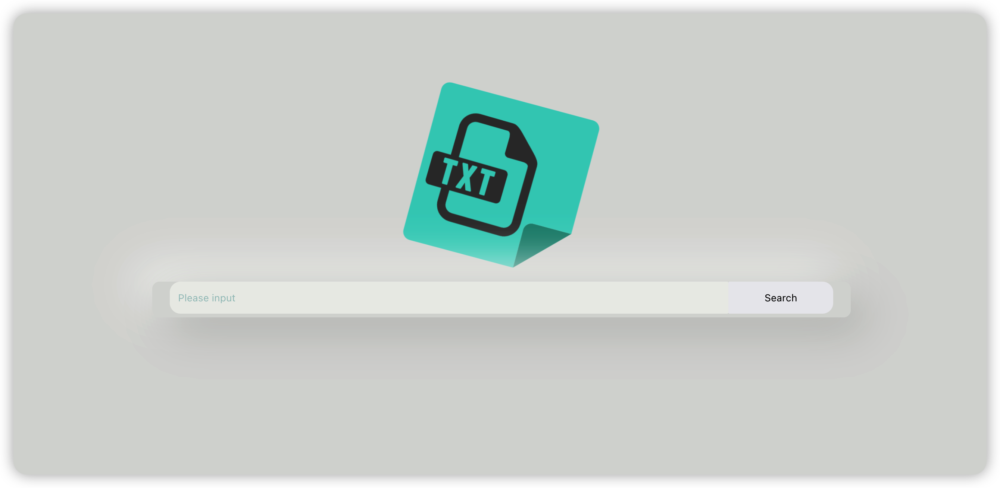
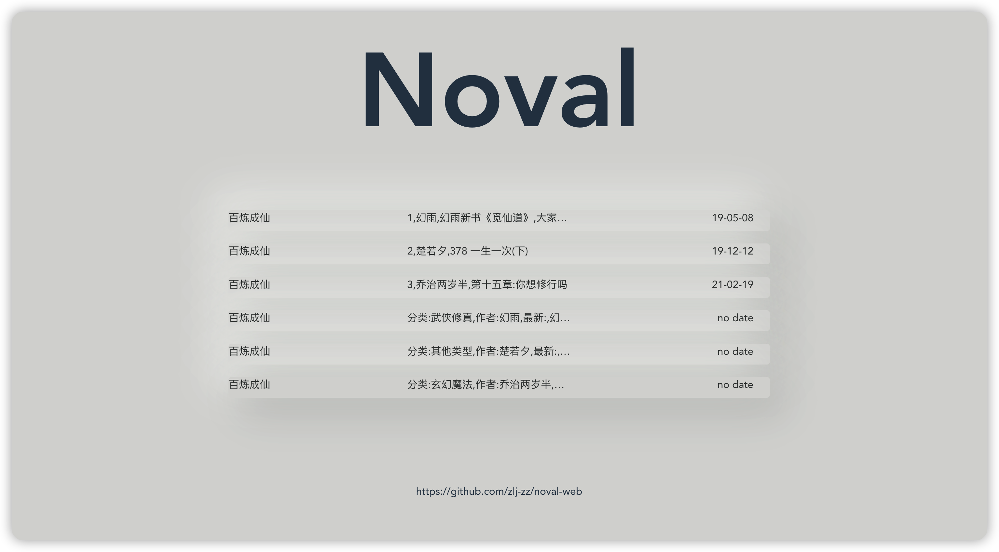

# Noval-Web

This is simple web to download fiction. Create with **Vue 3 + TypeScript + Vite**. And use **[noval](https://github.com/zlj-zz/noval)** as API.






# Setup

```bash
git clone https://github.com/zlj-zz/noval-web
cd noval-web
npm install
npm run dev
```
